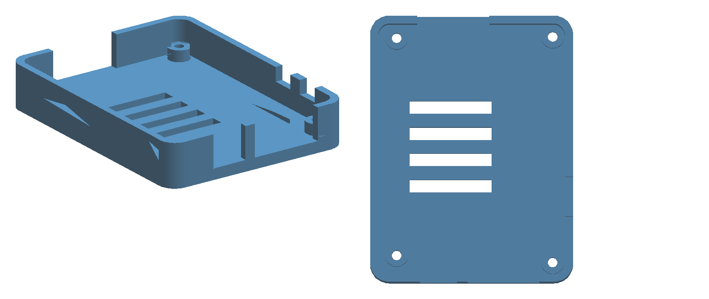

# Printed base tray for the T-ETH-Elite



```bash
pip install --user trimesh manifold3d
python3 case.py            # -> case_bottom.stl, plus the clearance report
python3 case.py --check    # report only
```

The tray the bottom board of the stack drops into:

```
   TSN Lab 10Base-T1S HAT          open, not enclosed - see below
   ── adapter PCB ──               ../t_eth_elite_hat_adapter/
   LilyGO T-ETH-Elite
   ── this tray ──
```

71.0 × 54.0 × 12.4 mm, 14.3 cm³, watertight, one part, no supports needed if
printed floor-down.

## Why a tray and not a box

The two lower boards have published CAD, so a part built against them can be
*checked* — `case.py` boolean-intersects the finished tray with LilyGo's own 3D
model of the Elite and refuses to pass if anything overlaps. The T1S HAT on top
has no published CAD; its size is known only from a product photo, and its
terminal block, rotary node-ID switch and wake/sleep button all have to stay
reachable anyway. Enclosing that from photo-derived numbers would be guessing
dressed up as a design, so the tray stops below it.

## What the shape is actually doing

Every opening exists because of a specific part measured out of LilyGo's model
(see `../pcb/GEOMETRY.md`):

| feature | why |
|---|---|
| left wall removed, y 10.0…29.4 | the RJ45 overhangs the PCB edge by 5.18 mm and dips 1.43 mm below it — a lowered wall would not clear it, it has to be gone |
| right wall opening, y 10.8…20.7 | USB-C, overhangs by 1.13 mm |
| right wall opening, y 23.4…42.7 | the WROOM antenna — LilyGo cut their own PCB away here, so no plastic against it either |
| far wall notched above z 2.0, at the two switch footprints | BOOT and RST. They are poked from above through the adapter's Ø4 holes; this lets a tool also come in from the side |
| 3.2 mm standoff under the PCB | the microSD socket hangs 2.06 mm below the board, the RJ45 1.43 mm |
| floor slots | vents, and less plastic |

## Hardware

Four M2.5 screws, long enough to go through the tray floor, the boss, and the
Elite's own hole, and bite into a female standoff above the board:

```
   adapter PCB
   ═══════════   M2.5 screw down from above
   [standoff]    M2.5 female-female, ≈13 mm - set by the stacking header, measure it
   ─ Elite PCB ─
   [boss 3.2]
   ═══════════   M2.5 screw up from below, head sunk in the Ø5.5 × 2.0 counterbore
   tray floor
```

The tray's holes are Ø2.7 clearance, not pilot holes — the screw passes
through, it does not thread into the plastic.

Standoff length is deliberately not specified here. It follows from whichever
2×20 stacking header gets fitted to the adapter, and that part has not been
bought yet. Measure the header, then buy standoffs.

## Verified / not verified

Verified, by `case.py` on every run:

- watertight solid, single body
- all four bosses land on the Elite's own asymmetric hole pattern
- **zero interference** with LilyGo's 3D model of the board: no overlap with any
  of its 35 solid bodies, and of 141 422 model vertices none fall inside the
  tray. (The check does flag 522 vertices sitting 0.012–0.025 mm inside — those
  are the zero-thickness copper-layer sheets the model draws 0.02 mm outside the
  substrate, which is an order of magnitude below anything a printer resolves.
  The script identifies that case explicitly rather than widening a tolerance
  until it passes.)

Not verified:

- **Never printed.** No dimensional check against a real board, no test of
  whether the 0.4 mm edge clearance is right for your printer.
- Wall height (6.0 mm above the PCB) is chosen to stay well under the adapter,
  which sits ≈13 mm up. That number comes from LilyGo's own shield, not from a
  header part anyone has in hand.
- No lid, no HAT enclosure — deliberately, see above.

## Mounting it to something

`DECK` at the top of `case.py` is `None`. Set it to `(35.0, 45.0)` to add the
plate-B deck hole pattern from `~/stl-model/acrylic-frame`, so this bolts onto
the same laser-cut rig as the other boards there.
