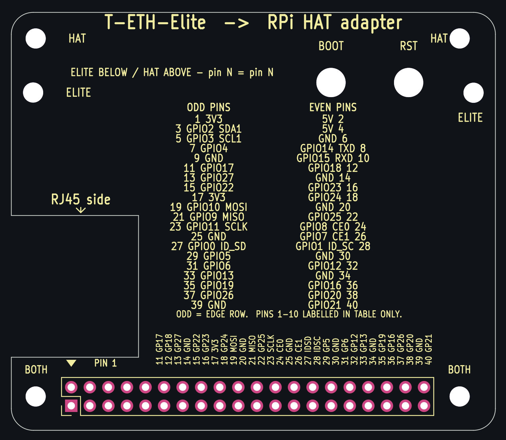

# T-ETH-Elite → Raspberry Pi HAT adapter

A passive spacer/notch board that lets a real Raspberry Pi HAT — specifically
TSN Lab's **10BASE-T1S HAT (LAN8651)** — sit on a
[LilyGO T-ETH-Elite](https://github.com/Xinyuan-LilyGO/LilyGO-T-ETH-Series)
(ESP32-S3) instead of on a Pi.

One connector, six mounting holes, two tool-access holes, **no traces, no
zones, no nets**. Every number on the board comes from
[`GEOMETRY.md`](GEOMETRY.md), which was measured from LilyGo's own DXF and 3D
CAD and cross-checked against two more independent sources. That file is the
source of truth; the board is generated from it by
[`make_board.py`](make_board.py).



## Why this board exists at all

Not for pin mapping. The T-ETH-Elite's 40-pin header is already a Raspberry Pi
header, and — this is the part worth stating plainly — **its geometry already
matches the Pi's too**. Deriving the Pi near-hole positions from the header
alone (field centre 32.326 ± 29.0, y = the header centre 4.63) gives
(3.326, 4.63) and (61.326, 4.63); the Elite's own bottom mounting holes are at
(3.33, 4.63) and (61.33, 4.63). **0.005 mm.** A HAT would bolt straight onto
those two holes with nothing in between.

What stops it is height:

| part on the Elite | top (LilyGo CAD z) | above the PCB surface |
|---|---|---|
| **RJ45 with magnetics** | **15.97 mm** | 15.17 mm |
| 40-pin header pins | 10.10 mm | 9.30 mm |

(CAD centres the 1.575 mm PCB on z = 0, so its top face is 0.80. The gap that
matters is a difference and is the same either way.)

**The RJ45 stands 5.87 mm proud of the tallest pin.** A HAT pushed onto that
header fouls the jack long before its socket seats, because a standard HAT is a
flat rectangle spanning the left half of the board. LilyGo hit the same wall on
their own LoRa/LTE/Gateway shields and cut a notch for it.

Be precise about what follows from that, though: **a tall enough stacking
header would lift a HAT clear of the RJ45 on its own**, no adapter needed. What
it would not solve is the mounting. A HAT's far hole pair sits 49 mm from the
near pair, i.e. at y = 53.63 — past the Elite's own edge at 49.19, with nothing
underneath it. So the HAT would hang off two screws at the connector end, on a
board whose T1S terminal block you push and pull levers into.

What this board actually buys you, in order of how hard they are to get
otherwise: **the far mounting pair** (four-corner support), **BOOT/RST access**
through a board that would otherwise bury both switches, and the notch.

## Stack-up

```
   TSN Lab 10BASE-T1S HAT (LAN8651)
        ↑ plugs onto the pins protruding above this board
   ── this adapter ──                    ≈13 mm above the Elite PCB
        ↑ stacking-header socket swallows the Elite's 9.30 mm pins
        ↑ RJ45 (15.97) passes up through the notch
   LilyGO T-ETH-Elite (ESP32-S3)
```

## The board

- **Outline** 66.22 × 57.20 mm, 3 mm rounded corners, 2-layer, 1.6 mm.
  Same width as the Elite, extended 8.0 mm in +y so it can carry the HAT's far
  mounting holes, which land past the Elite's own edge.
- **RJ45 notch** x 0…17.40, y 10.00…29.40 — a rectangular bite out of the left
  edge, deliberately ~0.5 mm looser all round than the RJ45's measured
  envelope. That region is empty board here, so the clearance is free.
- **Six Ø2.75 non-plated holes** (M2.5 free fit):

  | ref | position | serves |
  |---|---|---|
  | H1 | (3.33, 4.63) | Elite bottom-left **and** HAT near-left |
  | H2 | (61.33, 4.63) | Elite bottom-right **and** HAT near-right |
  | H3 | (2.98, 46.23) | Elite top-left |
  | H4 | (63.23, 46.20) | Elite top-right |
  | H5 | (3.33, 53.63) | HAT far-left |
  | H6 | (61.33, 53.63) | HAT far-right |

  **H1/H2 are shared between the Elite and the HAT on purpose** — see the
  0.005 mm above. One pair of holes is drilled, not two. Silkscreen marks
  which is which: `BOTH` / `ELITE` / `HAT`.

  The Elite's four holes are **not a rectangle**: 58.00 mm apart at the bottom,
  60.25 mm at the top. That asymmetry is real LilyGo design (three independent
  files agree to <0.1 mm) and it is useful — the pattern is self-keying, so
  this board physically cannot be bolted on rotated 180°.

- **Two Ø4.0 non-plated tool holes** at (43.73, 47.60) `BOOT` and
  (54.35, 47.60) `RST`, over the Elite's two ST-1133 tactile switches
  (SW4 = BOOT, SW5 = EN/RESET), which this board would otherwise bury. Centres
  are the midpoints of the switch bodies in LilyGo's CAD. Ø4.0 is a
  tweezer/pen tip, not a finger.

- **One 2×20 THT connector**, pins on x = 8.196 + 2.54·k (k = 0…19),
  y = 3.360 and 5.900. Plated through-holes, Ø1.0 drill / Ø1.7 pad, annular
  rings both sides — the solder joint is what mechanically anchors the stack.
  Stock `Connector_PinHeader_2.54mm:PinHeader_2x20_P2.54mm_Vertical` pad
  geometry, rotated 90° and translated so its pads land on that grid (the
  generator measures the resulting pad vectors rather than trusting the
  footprint's anchor convention).

  **One part, not two.** Earlier versions of this board modelled the joint as a
  male header on top plus a female socket on the bottom sharing holes, with 40
  pass-through traces. That is not how it is built. The real part — the one
  LilyGo fit to their own shields — is a single **stacking header**: socket
  barrel below the PCB, pins through and above it. One footprint, one set of 40
  holes, and **no copper between them at all**. The signal path is the header's
  own pin; pin-to-pin identity is a property of the part, not of the board.
  Every pad is an isolated net by design, not by oversight.

- **Silkscreen** carries the whole Raspberry Pi 40-pin function map, because
  the Elite's own header is unlabelled: a per-pin vertical label above each
  column for pins 11–40, a full 40-entry table for all of them, the pin-1 end
  marked, `RJ45 side` by the notch, hole roles, and `T-ETH-Elite -> RPi HAT
  adapter` across the top. The back reads `T-ETH-Elite SIDE`.

  Pins 1–10 get table entries but no per-pin label: their columns sit inside
  the notch's x span, and between the connector body (which covers the board up
  to y = 8.40) and the notch (which starts at y = 10.00) there is no room for a
  legible string. Everything else is labelled at the pin.

### Which pin is pin 1 — derived, not measured

`GEOMETRY.md` fixes the pin *grid* but not the *numbering*, and LilyGo do not
silkscreen it on the Elite (that is part of why this board is worth having).
The labels here assume **pin 1 at the low-x end, on the y = 3.360 row** (odd
pins on the row nearer the board's y = 0 edge, even pins on y = 5.900), on two
grounds:

1. Standard Raspberry Pi: odd pins are the outer row, nearest the board edge.
2. On the Elite, header pins 35 and 37 carry `USB_DN`/`USB_DP` (LilyGo
   schematic sheet 2, J1). Those route to the USB-C receptacle, which is at the
   Elite's **right-hand** edge — so the pin-40 end is at high x, and pin 1 is at
   low x, next to the RJ45. The PoE/5 V input being on the same left side as
   pins 2/4 agrees.

This is an inference, not a measurement. It affects only the silkscreen: the
connection itself is the stacking header's own pin and is correct either way.
If you have a board in hand, check it against the table before trusting a
label.

## Files

| File | What |
|---|---|
| `GEOMETRY.md` | **The source of truth.** Provenance for every number. |
| `make_board.py` | Generator. Emits the `.kicad_pcb` via KiCad 7 `pcbnew` bindings, reads it back and asserts every coordinate, runs DRC, then does all the `kicad-cli` exports. Re-runnable and diffable. |
| `t_eth_elite_hat_adapter.kicad_pcb` / `.kicad_pro` | KiCad 7 board + project |
| `gerbers/t_eth_elite_hat_adapter_gerbers.zip` | Fab-ready: 7 gerber layers, separate PTH/NPTH Excellon drill, drill maps, job file |
| `cpl.csv` | Position file (one line) |
| `bom.csv` | BOM (one line) |
| `preview.svg` / `preview.png` | Front view, so the shape can be seen without opening KiCad |
| `drc.rpt` | DRC report as produced, nothing excluded |

Regenerate everything with `python3 make_board.py`. Geometry is reproducible
to the last internal unit, but the output is not byte-reproducible: KiCad
stamps fresh UUIDs into the `.kicad_pcb` and timestamps into the gerbers on
every run, so a re-run always shows as a diff. Compare the printed coordinate
table, not the files.

Drill files and `cpl.csv` are plotted against the drill/place origin, which the
generator puts on `GEOMETRY.md`'s own origin — so e.g. `NPTH.drl` literally
reads `X3.33Y4.63` and `cpl.csv` reads `8.196, 3.360`. They can be diffed
against `GEOMETRY.md` by eye.

### BOM — one line

A **2×20, 2.54 mm stacking header**: female socket barrel ≈13 mm below the
PCB, pins ≈9 mm above it, one part through one set of 40 holes. The same class
of part LilyGo fit to their own T-ETH-Elite shields. LCSC left blank — the
exact barrel/pin lengths decide the standoff heights, so pick the part first.

### Standoffs

Pick the header first, then the standoffs to match it, not the other way round:

- **Elite → adapter**: set by the chosen header's barrel, ≈13 mm. Must be
  ≥ 15.97 + a little if you want the RJ45 to clear without the notch doing the
  work; with the notch, the barrel height is what it is and the standoffs just
  have to match it. M2.5, four off (H1–H4).
- **Adapter → HAT**: set by that header's above-board pin length. M2.5, four
  off (H1, H2, H5, H6).

## Verification

Every hole centre and all 40 pad centres were read back out of the written
`.kicad_pcb` and compared against `GEOMETRY.md`: **worst error 0.00000 mm**
(tolerance 0.01 mm), 48 of 48 features. `make_board.py` prints the full table
and exits non-zero if any row fails.

### DRC — as reported, nothing excluded

This machine's `kicad-cli` has no `pcb drc` subcommand, so DRC is run through
`pcbnew.WriteDRCReport()` — the same engine — from the generator:

```
** Found 8 DRC violations **
** Found 0 unconnected pads **
** Found 0 Footprint errors **
```

All 8 are the same `lib_footprint_issues` warning, one per hole: *"the current
configuration does not include the library 't_eth_elite_hat_adapter'."* The six
Ø2.75 and two Ø4.0 NPTH holes are generated inline by the script and belong to
no footprint library, so the library-consistency test has nothing to compare
them to. No clearance, courtyard, hole-clearance, silk, edge or connectivity
finding. Nothing is suppressed or excluded; running it yourself reproduces
exactly this.

Two findings were fixed in the generator rather than waved away:

- a real `silk_edge_clearance` hit — pin 9's label crossed the notch edge.
  Per-pin labels now stop where the notch starts.
- J1 had no library link, so the same test could not check it either. It now
  carries its true `Connector_PinHeader_2.54mm:` FPID, and the generator points
  KiCad at its installed library so the test actually runs against the stock
  footprint. It passes.

### No schematic, deliberately

There is no `.kicad_sch`. A board with one connector and no nets has no
meaningful schematic, and inventing one purely to be able to report "ERC clean"
would be worse than having none. The previous version of this board did have
one; it existed only to hold 40 net labels for traces that should never have
been there.

## What is NOT verified — read this before ordering

- **Nothing has been bench-tested.** No adapter, no HAT and no T-ETH-Elite were
  in hand. This is a design, not a working assembly.
- **The HAT's hole pattern is photo-derived.** Measured off the product photo
  scaled by the known 48.26 mm pin-row span, it comes out as a rectangle with
  ratio 0.852 against the Pi spec's 49/58 = 0.845 — consistent with a standard
  Pi pattern, which is why H5/H6 are placed at the Pi's +49.0 mm offset. That
  is the one decision resting on a photo. The listing's "57×75×23 mm" does not
  match the photo and is assumed to be packaging.
- **Pin 1's end is inferred**, not measured — see above.
- **The stacking header is specified by class, not by part number.** Barrel and
  pin lengths vary between vendors and they set both standoff heights.
- **No order was placed.** There is no browser/checkout access here. The
  deliverable is fab-ready files to upload yourself.

Everything the board's *geometry* depends on is measured, not estimated — see
[`GEOMETRY.md`](GEOMETRY.md) for the provenance of each number, including which
of the three LilyGo source files each came from and which set was physically
validated against a real board on a laser-cut plate.

## History

This replaces a board built on KiCad's stock `RaspberryPi-HAT` template: a
65 × 56.5 mm outline with four holes on a 58 × 49 mm **rectangle**, no RJ45
notch, and two coincident footprints joined by 40 pass-through traces. Three
independent things were wrong with it — the Elite's holes are not a rectangle,
an un-notched board fouls the RJ45, and the connection is one stacking header
rather than a header plus a socket plus copper. It was rebuilt from
`GEOMETRY.md` rather than patched.
