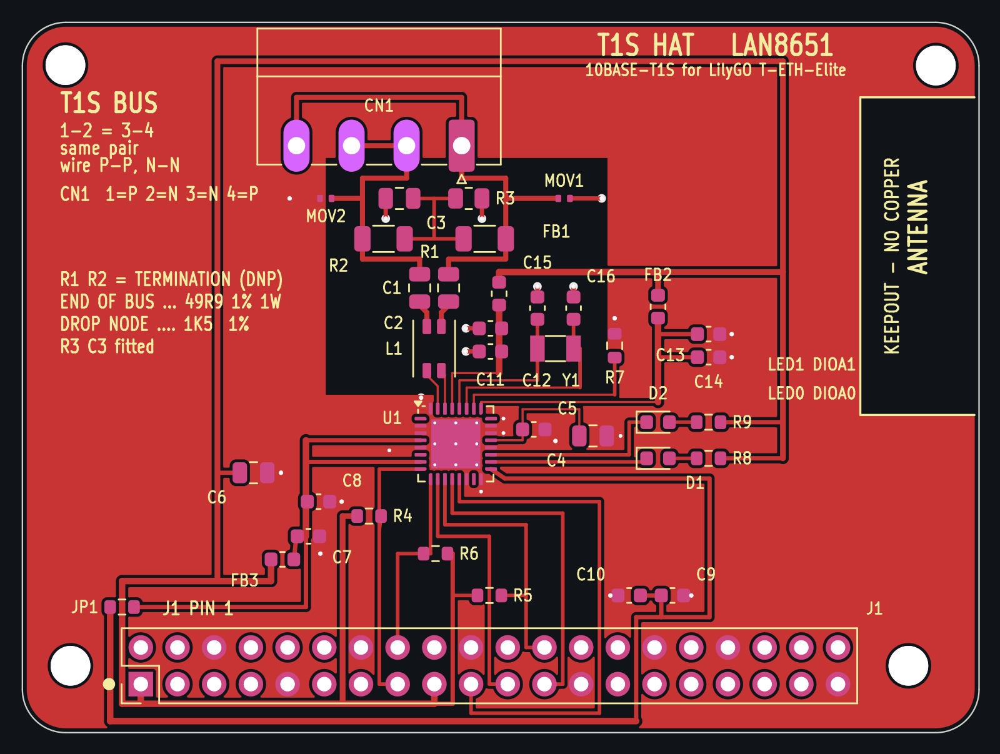

# T1S HAT — LAN8651 10BASE-T1S for the LilyGO T-ETH-Elite

Our own 10BASE-T1S board for the [LilyGO
T-ETH-Elite](https://github.com/Xinyuan-LilyGO/LilyGO-T-ETH-Series)
(ESP32-S3), built around a **Microchip LAN8651** MAC-PHY. It replaces buying
TSN Lab's ready-made HAT: same chip, same host header, our schematic.

Two source files govern this board and **nothing here re-derives a number in
either of them**:

| file | governs |
|---|---|
| [`ELECTRICAL.md`](ELECTRICAL.md) | every component, value and pin-handling rule, each quoted from Microchip DS60001734F or AN1718 (DS60001718D) |
| [`../pcb/GEOMETRY.md`](../pcb/GEOMETRY.md) | outline, mounting holes, 2×20 grid — measured from LilyGo's own DXF and 3D CAD |

Everything is generated by [`make_t1s_hat.py`](make_t1s_hat.py), which emits
the symbol library, the two project-local footprints, the schematic and the
PCB, then reads the board back and asserts every mechanical feature against
`GEOMETRY.md`.



## What it is

- **LAN8651**, 32-VQFN 5×5, single 3.3 V rail (the '51 regulates its own 1.8 V
  core, so there is no second regulator and no sequencing diode).
- **OPEN Alliance TC6 SPI** to the host on the same header pins TSN Lab's
  device-tree overlay uses, so their SDK and the mainline `microchip,lan8651`
  driver both work unmodified if this board is ever put on a Pi.
- **Bus interface network** in AN1718's MINIMAL BIN order: common-mode choke →
  AC coupling caps → termination → ESD → 4-way 3.81 mm pluggable terminal
  block, wired so the node taps a daisy chain.
- 38 parts, 4 of them deliberately unstuffed. One of the 38 is a 0 Ω jumper,
  and it is a design decision, not an accident — see below.

## The two parts that had to be chosen, not assumed

Both are drawn from their own data sheet into
[`fp/t1s_hat.pretty`](fp/t1s_hat.pretty), generated by `make_t1s_hat.py`
alongside the board, and the generator asserts the pad count and the overall
land size back out of the finished `.kicad_pcb`.

### L1 — TDK **ACT1210L-201-2P-TL00**, LCSC **C131444**

AN1718 names ACT1210D-131-2P-TL00, ACT1210E-241-2P-TL00 and Murata
DLW32MH241MX2, and says in the same breath that *"exact component part numbers
and parameters must be determined by the customer's unique application
requirements"* — they are examples. All three are **3.2 × 2.5 mm** (EIA 1210)
2-line chokes in the 130…240 µH @ 100 kHz band. The board previously sat on
KiCad's `Inductor_SMD:L_CommonMode_Wurth_WE-CNSW-1206`, a **3.2 × 1.6 mm**
land: same length, 0.9 mm too narrow, so the real part's terminals miss the
pads. KiCad ships no 4-terminal common-mode choke land in 3225.

The part fitted instead is the **ACT1210L-201-2P-TL00**: same ACT1210 package,
200 µH @ 100 kHz — inside the span AN1718's own examples cover — 70 mA,
5.5 Ω, AEC-Q200, and, unlike all three examples, **stocked at LCSC**
(C131444, ~$0.39/1k), which is where this board gets built.

Its land is `t1s_hat:L_CommonMode_TDK_ACT1210_3225`, drawn from TDK's ACT1210
data sheet "Layout recommendation" (drawing IND1512-9): **4.1 mm overall
across the pads with a 2.0 mm gap between the columns**, so each pad is
1.05 mm long on a 3.05 mm pitch, and **1.6 mm overall across the rows with a
0.4 mm gap**, so each pad is 0.60 mm wide on a 1.0 mm pitch. Body from the
same sheet: 3.2 ±0.2 long, 2.5 ±0.2 wide, 3.9 max over the terminals.

The symbol changed with it: the ACT1210's windings are **1-4 and 2-3**
(pin configuration and circuit diagram, same sheet), which is
`Device:L_Coupled_1423`, not the `…_1243` the 1206 Würth part needed.

### MOV1 / MOV2 — TDK **AVRH10C221KT1R5YA8**, LCSC **C2157827**

This is the part `ELECTRICAL.md` already names, and it is a **1005 [0402]**
chip varistor — 1.0 × 0.5 × 0.5 mm, 220 V V1mA, 70 V DC, **1.5 pF**, 25 kV per
IEC 61000-4-2. The board had it on `Resistor_SMD:R_1206_3216Metric`: three
size codes too big. It is now on `t1s_hat:Varistor_TDK_AVRH10_1005`, from the
recommended land pattern in TDK's automotive AVR chip-varistor catalogue
(pad 0.35…0.45 long, gap 0.3…0.5, pad 0.4…0.6 wide — the middle of each:
**0.40 long, 0.40 gap, 0.50 wide**). KiCad's `R_0402_1005Metric` is 0.54 ×
0.64 on a 1.02 mm pitch, outside all three ranges, which is why this one is
drawn here too. Both parts stay **DNP**; the land is now a real one.

## Three decisions that are not in ELECTRICAL.md / GEOMETRY.md

These were directed after those files were written. They are marked
`DIRECTED:` in the generator, and the reasoning is recorded here.

### 1. Two layers, not four

`ELECTRICAL.md` calls 4 layers non-negotiable because AN1718 wants TRXP/TRXN
as length-matched, impedance-controlled 50 Ω single-ended traces, and 50 Ω on
2-layer 1.6 mm FR4 needs a ~2.9 mm trace. The width figure is right; the
conclusion does not follow at this speed and length. 10BASE-T1S runs at
12.5 MBd with deliberately slow, EMC-shaped edges, and the run from the QFN to
the connector here is ~20 mm — electrically short, well under the length at
which a mismatch on a trace this short costs anything at these edge rates.
AN1718's 50 Ω line is a "do this and you are safe" recommendation, not a
threshold this design crosses.

**So the impedance is not controlled and is not claimed to be.** The pair is
0.35 mm over 1.51 mm of FR4, which is nowhere near 50 Ω. What buys the margin
back instead is layout discipline, and those rules are treated as hard:

- **All signal routing is on F.Cu. B.Cu is an uninterrupted ground pour.**
  The generator asserts this — `verify()` counts B.Cu tracks and the table
  prints `B.Cu signals … 0 tracks`.
- The only two interruptions in that plane are the antenna keepout and the
  all-layer void under the choke, both of which AN1718 or the Elite requires,
  and the choke void is sized to the choke — see inference 8.
- The one crossing that a single signal layer could not absorb is a **0 Ω
  jumper on F.Cu**, not a via pair through the plane. See below.
- TRXP/TRXN are short, symmetric about x = 29.0 from the QFN to the connector,
  and carry **no vias**.

Moving to 4 layers with a dedicated reference plane is the fallback if EMC
measurements later ask for it. It is not a cost compromise.

### 2. No RJ45 notch — the outline is a plain rectangle

`GEOMETRY.md`'s notch exists because a board ~13 mm above the Elite would foul
the RJ45, which stands 15.97 mm. This board is lifted clear of the jack by a
taller riser instead, so nothing has to be cut away. Outline is the full
**66.22 × 49.19 mm rectangle, 3 mm corners**. Everything else mechanical in
`GEOMETRY.md` is unchanged and still authoritative: the four asymmetric
mounting holes and the 2×20 grid.

That is also what makes the 2-layer decision work — the notch was the largest
interruption in the bottom-side ground pour, right where the pair and its
choke want a clean reference.

### 3. The connection is two-stage — read this before ordering parts

```
   T1S HAT  (this board)
        ↑ its 2x20 socket goes on the riser's long pins
   ── 2x20 stacking riser ──          ≈18-20 mm total, set by the riser
        ↑ riser socket swallows the Elite's own 9.30 mm pins
        ↑ RJ45 (15.97 mm) passes beside the stack, not through a notch
   LilyGO T-ETH-Elite (ESP32-S3)
```

**A single tall stacking header does not work here.** The Elite's pins are
only 9.30 mm long; they would reach barely halfway up a ~17 mm barrel whose
contacts sit near the top. You need a **riser** (a 2×20 stacking header that
plugs onto the Elite and presents longer pins) plus this board's **socket**.
That is a real failure mode someone will otherwise hit at the checkout page.

Board height above the Elite PCB is **assumed ≈18–20 mm**, set by the riser.
Nothing on this board depends on the exact number.

## Stack-up assumed

JLCPCB's standard 2-layer 1.6 mm FR4 build, written into the board file:

| layer | | thickness |
|---|---|---|
| F.Cu | signals + GND flood | 0.035 mm (1 oz) |
| core | FR4, εr ≈ 4.5 | 1.510 mm |
| B.Cu | **ground plane, nothing else** | 0.035 mm (1 oz) |

Design rules: 0.15 mm minimum clearance and track, 0.45 mm minimum via
(0.25 mm drill), 0.20 mm minimum through-hole drill — the last one because the
stock `…_ThermalVias` QFN footprint uses 0.20 mm holes under the exposed pad.

## Termination stuffing — the one thing an assembler must decide

The board **ships with R1/R2 unstuffed**, per `ELECTRICAL.md` ("footprints
fitted, DNP by default — stuff per where this node sits on the bus"). The
silkscreen carries the table:

| where this node sits | R1, R2 |
|---|---|
| **end of the bus** | 49R9 1 % 1 W 1206 |
| **interior drop node** | 1K5 1 % 1206 |

`R3` (100 k) and `C3` (100 nF) — AN1718's common-mode termination — **are
fitted**. ESD elements MOV1/MOV2 have footprints and are DNP; `ELECTRICAL.md`
calls them optional.

`CN1` is wired **P N N P**, and the silkscreen carries that as a legend
(`CN1 1=P 2=N 3=N 4=P`) in the clear area to its left. Per-pad letters were
dropped: the four pads are 1.8 × 3.6 mm ovals with the connector's own body
outline 0.9 mm below them and R3/C3 0.6 mm below that, leaving a 0.6 mm slot —
nowhere to letter a pad without printing on copper. Pins 1–2 and 3–4 are the
same pair with opposite orientation, so wire P to P and N to N rather than
pin-for-pin. That order is what lets both on-board links be drawn without a
crossing.

## Verified

- **Mechanical: worst error 0.00000 mm** against `GEOMETRY.md`, tolerance
  0.01 mm, over the outline, all four mounting holes and all 40 header pads.
  `make_t1s_hat.py` prints the full table and exits non-zero on any failure.
- **Antenna keepout clean.** The generator walks every track, via, footprint
  and *filled zone polygon* on both layers and counts anything inside
  x 58…66.22, y 22…44: **0 intruders.** The keepout is a rule area that forbids
  copper, tracks, vias, pads and footprints on both layers, so both pours are
  cut out there. Silkscreen (ink, not copper) does mark the window.
- **B.Cu carries 0 signal tracks.**
- **Unrouted connections: 0.**
- **L1 and MOV1/MOV2 lands read back as 4.10 × 1.60 mm on 4 pads and
  1.20 × 0.50 mm on 2 pads** — the data sheet numbers above, asserted out of
  the board file, not just written into it.
- **ERC: 0 errors, 5 warnings** — see below.
- **DRC: 0 errors, 4 warnings** — see below.

### ERC — 0 errors

`kicad-cli` 7.0.11 has no `sch erc` subcommand, only `export`, so ERC is run
through the real eeschema on an Xvfb display by
[`run_erc.sh`](run_erc.sh), with **Show: All and Exclusions both ticked**
before the run. Report as produced: [`erc.rpt`](erc.rpt).

```
** ERC messages: 5  Errors 0  Warnings 5
```

All 5 warnings are the same thing: *"Pins of type Bidirectional and Power
output are connected"* on U1 pins 20, 22, 23 (DIOA2/3/4) and 16, 14
(DIOB0/DIOB1). Those are the unused configurable IO tied to ground, which is
exactly what the data sheet says to do — *"When not used, these pins may be
connected directly to ground."* Nothing is excluded or suppressed.

### DRC — 0 errors, 4 warnings

Run through `pcbnew.WriteDRCReport()` (same engine; `kicad-cli` has no
`pcb drc` either). Report as produced: [`drc.rpt`](drc.rpt).

```
** Found 4 DRC violations **
** Found 0 unconnected pads **
** Found 0 Footprint errors **
```

**Zero errors of any kind** — no clearance, hole, courtyard, keepout,
solder-mask, silkscreen or unconnected-pad violation. All four remaining
warnings are the same one:

| count | what |
|---|---|
| 4 | `lib_footprint_issues` — the four Ø2.75 mounting holes are generated inline and belong to no footprint library, so the library-consistency test has nothing to compare them to (same as `../pcb/`) |

Nothing is excluded. Running it yourself reproduces exactly this.

## Two crossings on one layer, and how they were closed

The host bundle is **not planar on one layer**. With the LAN8651's pin order
(IRQ 9, SDO 10, CS_N 11, SCLK 12, SDI 13, left to right along the QFN's bottom
edge) and `ELECTRICAL.md`'s header assignment (IRQ→16, MOSI→19, MISO→21,
SCLK→23, CS_N→24), SDI/MOSI starts at the right-hand end of the QFN and has to
reach the left-hand end of its target group, so it must cross the other four.
MOSI takes the long way round — out to x = 39.9, down, and back along a 2 mm
band under the header — which resolves that crossing, but the loop it traces
then encloses the CS_N column, and 3V3 enters the board outside that loop.
VDDP is fenced in the same way, by the +3V3 tree, the header row and the SPI
fan-out. That left one crossing on each of two nets.

**B.Cu was not used for either.** The uninterrupted bottom pour is the thing
buying back the fourth layer on this design; `B.Cu signal tracks: 0` is still
asserted by the generator and still true.

### `SPI_CS_N` — closed by moving R5, no new part

R5 (the 10 k CS_N pull-up) moved from (50, 12.4) to **(32.326, 9.5)**, where it
sits **astride the SPI_MISO column**: MISO runs vertically between R5's own two
pads. A 0603's pads are 0.85 mm apart, so a 0.25 mm track through the middle
keeps 0.30 mm to each — the textbook 2-layer crossover, except that the part
doing the hopping is one that had to be in the CS_N path anyway. Its 3V3 now
comes off the column that already feeds R6, and its CS_N leg lands straight on
the CS_N column. Cost: zero extra parts.

### `VDDP` — closed by JP1, a real 0 Ω jumper

There is no equivalent trick for VDDP: its two halves are both VDDP, and no
VDDP-to-VDDP part existed to hop with. So **JP1, a 0 Ω 0603, is fitted at
(6.9, 8.7)**, straddling the +3V3 branch that climbs the left edge — +3V3
passes between its pads. It is a real part, and it is real everywhere:

- in the schematic, as `Device:R`, with the net split either side of it
  (`VDDP` on the pin-7 island, **`VDDP_17`** on the pin-17 island, each with
  its own PWR_FLAG so ERC sees both as supplied);
- in [`bom.csv`](bom.csv) and [`cpl.csv`](cpl.csv), `Populate = fit`, described
  as *"FITTED — the board does not work without it"*;
- on the silkscreen, designator `JP1`, like every other part.

From JP1 the link runs round the outside of the header in the free ~1 mm lane
below it and climbs back between two pad columns at x = 42.486. Nothing else
goes under the header there: the +3V3 rail stops at y = 2.0 and MOSI's return
at y = 1.35, and both turn upward before that lane. It is a long way round —
the VDDP_17 net totals 84 mm of 0.30…0.45 mm track, about 0.1 Ω, ~3 mV at
50 mA — and each island keeps its own 0.1 µF + 0.01 µF at the pin, so the
length costs nothing that matters. **The short way round does not exist on one
layer**; the alternative was a via pair through the ground plane, which this
design does not spend.

## Silkscreen — 48 violations to 0

The silkscreen exists so the board can be assembled and debugged, and it was
not doing that job: designators sat on pads and on each other (`R3` across the
connector, `C1`/`C2` over pads, `MOV2` into `CN1`).

| | before | after |
|---|---|---|
| `silk_overlap` | 28 | **0** |
| `silk_over_copper` | 15 | **0** |
| `silk_edge_clearance` | 5 | **0** |
| designators dropped | — | **0 of 38** |

Library footprints put their reference wherever the library author did, which
on a board this dense is wherever the neighbour already is. They are placed by
the generator instead: `place_references()` tries each designator in a ring of
candidate positions around its own part — horizontal first, sideways only if
nothing horizontal fits — and keeps the first that clears every pad, via, ink
and the board edge. A part with nowhere legible left would lose its
designator rather than print an unreadable pile; in the end none had to.
Three positions are hinted (`J1`, `U1`, `R1`, `Y1`) because the ring around a
large or boxed-in part lands somewhere silly, and a hint still has to pass the
same clearance test as any other candidate.

Four other things moved with it:

- **Board text** was re-laid into the two areas that carry no pads — the strip
  left of the bus network and the top-right corner — and shortened to fit
  clear of CN1's body outline.
- **CN1's per-pad P/N letters** became one legend line; see above.
- **The J1 pin-1 marker** is a filled dot outboard of pin 1, not a stroked
  triangle above it. Above is where JP1 has to sit, and the triangle's three
  legs also overlapped *each other* at the apex — one filled shape cannot.
- **CN1 moved 0.35 mm inboard** (y 41 → 40.65): its body outline otherwise
  lands 0.02 mm from `Edge.Cuts`, and the keepout window's ink now stops
  0.32 mm short of the board edge instead of running onto it.

## Inferences — things not taken from the spec files

Flagged because they are judgement, not quotation:

1. **U1 pin 1 (INH) is left unconnected.** `ELECTRICAL.md`'s pin-handling
   table does not cover INH. DS60001734F Table 3-5 says *"When not used, this
   pin should be left unconnected"*, so it is, with no copper stub.
2. **L1 is a 200 µH part where AN1718's examples are 130 and 240 µH.**
   AN1718 gives no minimum or maximum, only three example part numbers and an
   instruction to pick for the application; 200 µH is inside the span they
   cover and is the value TDK itself lists for one-pair automotive Ethernet.
   The land pattern is quoted, not inferred — but the *choice of value inside
   that span* is judgement.
3. **The 0 Ω jumper JP1 and the net split `VDDP` / `VDDP_17`** are a layout
   decision, not something either spec file asks for. `ELECTRICAL.md` treats
   VDDP as one net; on this board it is one net with a 0 Ω link in it.
4. **The crystal is a 2-pin 3.2 × 1.5 mm package** (`Crystal_SMD_3215-2Pin`),
   not a 4-pin grounded-case one. `ELECTRICAL.md` specifies 25 MHz,
   fundamental, parallel, CL 18 pF and says nothing about the package; the
   2-pin part routes cleanly here. A grounded-case 3225 is better for EMC and
   is a footprint swap.
5. **XTI is declared `passive` in the LAN8651 symbol**, not `input`. It is an
   oscillator pin driven by a passive crystal; declaring it an input makes
   KiCad's `pin_not_driven` test fire on a net that has no driver by design.
   Common practice, but it is a choice.
6. **The 40-pin header is a project-local symbol**, `t1s_hat:HAT_HEADER_2x20`,
   not `Connector_Generic:Conn_02x20_Odd_Even`. Its pins carry real electrical
   types (the six host signals are `output`/`input`, everything else
   `passive`), because the ESP32 side really is the driver and the generic
   connector's all-passive pins make ERC report every SPI input as undriven.
   The **footprint** is the stock `PinHeader_2x20_P2.54mm_Vertical`.
7. **Header pin 1 is at the low-x end, odd pins on the y = 3.360 row.**
   Inherited from `../pcb/`, where it is derived (not measured) from the Pi
   convention and from USB_DN/DP on pins 35/37 routing to the Elite's
   right-hand USB-C. Affects silkscreen only.
8. **`BIN_VOID` = x 21…40.5, y 23.4…39.8** and **`CMC_VOID` = x 26.90…30.10,
   y 24.40…28.80.** AN1718 asks for "a void in the ground flooding on the
   outside layer surrounding the BIN" and "an all-layer void underneath the
   CMC" **without giving dimensions**, so both sizes are judgement. The first
   follows the BIN components. The second is the only place other than the
   antenna window where the B.Cu reference plane is cut, so it is sized to the
   part and no further: **the ACT1210's maximum body — 3.9 mm over the
   terminals × 2.7 mm wide (2.5 + tolerance) — plus 0.25 mm a side**, giving
   3.2 × 4.4 mm (L1 is rotated 90°, so the 3.9 runs along y). The margin
   covers placement tolerance and nothing else; the body is what couples to
   the plane, because the body is the core. That also covers the 4.1 × 1.6 mm
   land with room to spare. The void grew in x against the old number above,
   not because the margin grew but because the part did: the 1206 land it used
   to be sized around was the wrong part. C11/C12 moved 0.8 mm outboard so
   their ground vias stay clear of it.
9. **The T1S pair necks to 0.15 mm at the QFN.** The package puts TRXP and
   TRXN 0.5 mm apart; AN1718's "3× trace width centre-to-centre to other
   signals" cannot be met between the pair's own two legs at a 0.5 mm-pitch
   QFN, and Microchip's own EVB does not either. It **is** met against every
   other net, by the F.Cu void around the BIN.
10. **Pair length match ≈0.2 mm.** TRXN opens out to the choke before TRXP
    does (so the gap only ever grows), which costs about 0.2 mm of mismatch —
    roughly 1.2 ps. Not measured on hardware.
11. **The stackup numbers** (1.51 mm core, εr 4.5, 1 oz outer copper) are
    JLCPCB's standard 2-layer build, taken as the assumption, not measured.

## Files

| file | what |
|---|---|
| `ELECTRICAL.md` | **electrical source of truth** |
| `make_t1s_hat.py` | generator: symbol lib → schematic → PCB → verify → DRC → exports |
| `run_erc.sh` | runs eeschema's ERC headlessly (Xvfb + xdotool) and saves the report |
| `fill_zones.sh` | fills the zones through pcbnew's GUI — `ZONE_FILLER` segfaults in KiCad 7.0.11's Python bindings |
| `t1s_hat.kicad_sch` / `.kicad_pro` / `sym-lib-table` / `fp-lib-table` | schematic + project |
| `sym/t1s_hat.kicad_sym` | **LAN8651** (33 pins incl. the exposed pad) and the host header — neither exists in KiCad's libraries |
| `fp/t1s_hat.pretty/` | the TDK ACT1210 choke land and the TDK AVRH10 varistor land, each from that part's own data sheet — KiCad ships neither |
| `t1s_hat.kicad_pcb` | the board |
| `gerbers/t1s_hat_gerbers.zip` | fab-ready: 8 gerber layers, separate PTH/NPTH Excellon, drill maps, job file |
| `bom.csv` / `cpl.csv` | BOM (with a `Populate` column) and position file |
| `preview-front.png/.svg`, `preview-back.png/.svg` | both sides |
| `erc.rpt` / `drc.rpt` | reports as produced, nothing excluded |

Regenerate with `python3 make_t1s_hat.py`. Geometry is reproducible to the
internal unit, but the output is not byte-reproducible — KiCad stamps fresh
UUIDs and timestamps on every run. Compare the printed coordinate table, not
the files.

Drill files and `cpl.csv` are plotted against the drill/place origin, which the
generator puts on `GEOMETRY.md`'s own origin, so `NPTH.drl` literally reads
`X3.33Y4.63` and `cpl.csv` reads `8.196, 3.360`.

## Bottom side — clear area for a later variant

The board now sits ~18–20 mm above the Elite, so **the bottom is usable**:

| region | clearance below |
|---|---|
| everywhere except the RJ45 footprint | ≈14 mm or more |
| over the RJ45, x −5.18…16.42, y 10.50…28.90 | **much less** — the jack tops out at 15.17 mm above the Elite's PCB |
| under the 2×20 socket, y 0…9 | occupied by the socket body |

Nothing is placed on B.Cu on this board (it is the ground plane). A radar
variant wanting that space should stay clear of the RJ45 column and of the
header, and must not slot the plane under the bus pair.

## What is NOT verified — read before ordering

- **Nothing has been bench-tested.** No board, no Elite, no riser in hand.
- **The two project-local lands are transcribed from data sheets, not
  measured.** L1's came from TDK's ACT1210 layout recommendation and MOV's
  from TDK's AVR catalogue; the generator asserts that what is in the board
  file matches what was transcribed, which is not the same as asserting that
  the transcription is right. Both are worth one look at the PDF before fab —
  they are the only two lands here that KiCad did not supply.
- **LCSC stock and part status were read from the catalogue, not ordered
  against.** C131444 (L1) and C2157827 (MOV1/2) were in stock when this was
  written; neither is confirmed as a JLCPCB *basic* part, so expect an
  extended-part fee or hand-placement for L1.
- **Impedance is not controlled** and the 50 Ω figure in `ELECTRICAL.md` is
  deliberately not met; see the 2-layer decision.
- **Oscillator margin was not calculated.** `ELECTRICAL.md` asks for >10; that
  depends on the crystal's ESR and C0, which are not fixed to a part number.
- **The riser is specified by class, not part number**, and it sets the stack
  height. Pick it before the standoffs.
- **No order was placed.** The deliverable is fab-ready files to upload.
